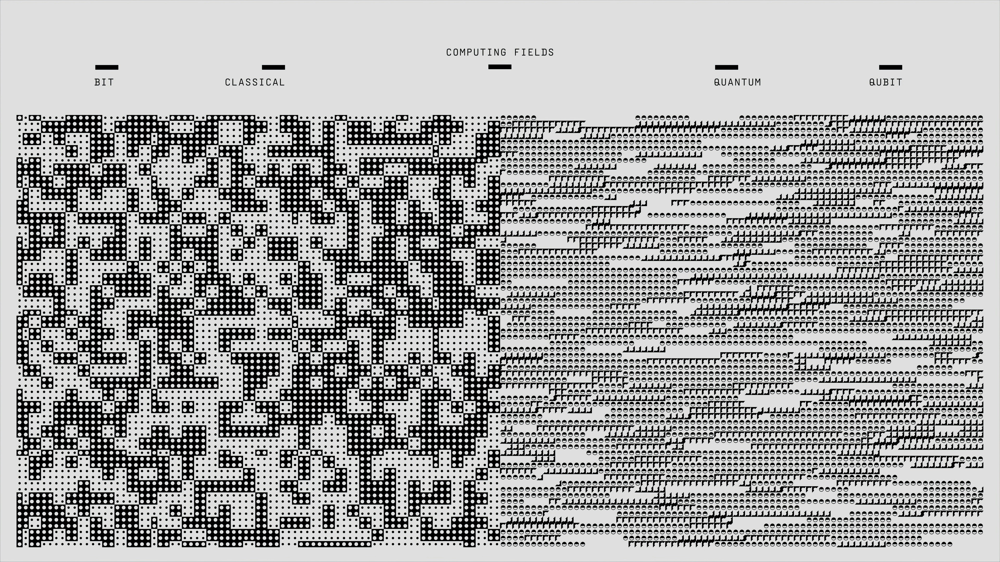

{width=250, fig-align="left"}

## Introduction

The rapid pace of AI development is undeniable, with frontier models increasingly outpacing the very evaluations designed to measure them. But as these systems achieve "superhuman" status across various tasks, validating those milestones presents a unique data science challenge: the "human baseline" they are beating is almost never a constant. Depending on the test, a model might be measured against a PhD expert, an unspecialized crowdworker, or even an estimate that was never formally tested.

In this post, I want to shift from analyzing individual reasoning tasks to performing a meta-analysis on the benchmarks themselves. Using logistic regression in R, we will explore whether the type of human baseline (e.g., expert vs. crowdworker) statistically impacts the likelihood of an AI model officially surpassing it.

## Imports
```{r}
#| message: false
#| warning: false
library(readr)
library(dplyr)
library(ggplot2)
```


## 1.Data Source & Pre-processing

This analysis investigates the cognitive domains where AI exceeds human capabilities using the [AI Benchmarks vs Human Baselines](https://www.kaggle.com/datasets/kylefengkfeng209/ai-benchmarks-vs-human-baselines) Kaggle dataset.


```{r}
benchmarks <- read_csv("data/benchmarks.csv", show_col_types = FALSE)
head(benchmarks)
```

## 2. Feature Engineering
To build our model, we need to filter out benchmarks that lack a measured baseline (where ai_exceeds_human is missing). We will also group the granular `human_baseline_type` into broader categories so our model has sufficient data per group.

```{r}
clean_benchmarks <- benchmarks |>
  filter(!is.na(ai_exceeds_human), !is.na(human_baseline_type)) |>
  mutate(
    baseline_category = case_when(
      grepl("expert", human_baseline_type) ~ "Expert Baseline",
      grepl("crowd|annotator", human_baseline_type) ~ "Crowdworker Baseline",
      TRUE ~ "Estimated/Other"
    ),
    baseline_category = as.factor(baseline_category)
  )

head(clean_benchmarks |> select(benchmark, baseline_category, ai_exceeds_human))
```