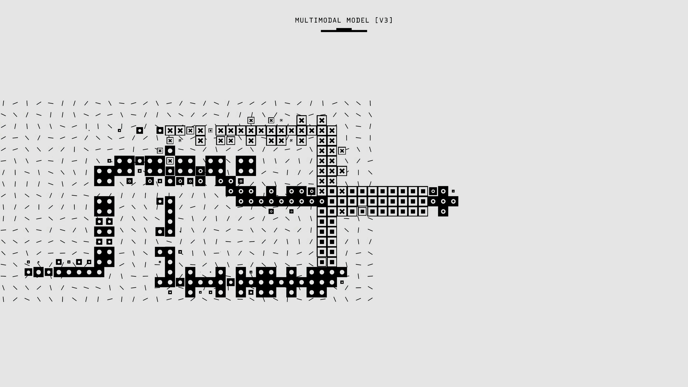

{width=250, fig-align="left"}

## Introduction

It is easy to read recent headlines about AI agents executing real-world cyber breaches and assume superhuman, agentic AI is already here. But whenever a lab claims their newest model has "surpassed human performance," there should be a clear definition of *Which* humans, and evaluated under *what* conditions? 

While marketing hype treats the "human baseline" as a monolithic gold standard, the reality ranges wildly—from three-time IMO gold medalists to unspecialized crowdworkers who gave up on 70% of the problems. That tension between alarming headlines and actual benchmark rigor is exactly why I chose this dataset. 

My goal for this post is to dig into item-level ConceptARC data, benchmarking 482 human testers directly against machine solvers on the exact same abstract reasoning tasks. A decision tree might seem mathematically naive compared to a massive language model, but training one across 16 core cognitive concepts cuts through the noise. It allows us to map exactly where the "superhuman" narrative is real, and where human intuition still thoroughly outpaces the machines.

## Imports 
```{python}
#| message: false
#| warning: false
import pandas as pd
import altair as alt
from sklearn.tree import DecisionTreeClassifier
from sklearn.model_selection import train_test_split
from sklearn.metrics import accuracy_score

```

## 1. Data Source & Pre-processing

This analysis utilizes item-level test data from the [AI Benchmarks vs Human Baselines](https://www.kaggle.com/datasets/kylefengkfeng209/ai-benchmarks-vs-human-baselines?utm_source=gemini) dataset. We will examine `conceptarc_human_vs_machine.csv`, which records success rates across 528 identical abstract reasoning tasks.

```{python}
conceptarc = pd.read_csv("data/conceptarc_human_vs_machine.csv")
conceptarc.head()

```

## 2. Feature Engineering

We can calculate the best machine's exact score by subtracting the performance gap from the human accuracy. We also need to create a binary target variable (`machine_passed`) indicating whether at least one of the machine solvers succeeded on the task.

```{python}
conceptarc['best_machine_accuracy'] = conceptarc['human_accuracy'] - conceptarc['human_minus_best_machine']
conceptarc['machine_passed'] = (conceptarc['n_machine_solvers_correct'] > 0).astype(int)
conceptarc.head()

```

## 3. Machine Learning: Decision Tree Classifier

Can we predict if a machine solver will fail based entirely on how humans performed and the type of concept being tested? We will use `get_dummies` to convert the categorical `concept_group` into numeric flags for scikit-learn.

```{python}
X = pd.get_dummies(conceptarc[['concept_group', 'human_accuracy']], drop_first=True)
y = conceptarc['machine_passed']

X_train, X_test, y_train, y_test = train_test_split(X, y, test_size=0.2, random_state=42)

clf = DecisionTreeClassifier(max_depth=3, random_state=42)
clf.fit(X_train, y_train)
accuracy = clf.score(X_test, y_test)
print(f"Decision Tree Prediction Accuracy: {accuracy:.2%}")

```

Our shallow decision tree achieves roughly 64% accuracy. While not perfect, this confirms a structural pattern in the data: machines are not failing randomly. By simply knowing the cognitive concept being tested (like 'spatial boundaries') and the human success rate, we can somewhat reliably predict if the AI will stumble.

## 4. Data Wrangling for Visualization

To see exactly where the machines are failing, we will aggregate the dataset by concept group to find the average human accuracy, best machine accuracy, and the resulting performance gap.

```{python}
concept_summary = conceptarc.groupby('concept_group').agg(
    Avg_Human_Accuracy=('human_accuracy', 'mean'),
    Avg_Machine_Accuracy=('best_machine_accuracy', 'mean'),
    Avg_Gap=('human_minus_best_machine', 'mean')
).reset_index()

```

## 5. Interactive Altair Visualization

Finally, we can plot the average human success rate against the machine success rate for each concept group. The red dashed line represents parity ($y=x$). Any concept falling below this line is a cognitive task where human intuition still beats the machine solvers.

```{python}
#| label: fig-conceptarc-gap
#| fig-cap: "Human vs. Machine success rates across ConceptARC abstract reasoning tasks."
#| warning: false
#| message: false

scatter = alt.Chart(concept_summary).mark_circle(size=120, opacity=0.8).encode(
    x=alt.X('Avg_Human_Accuracy:Q', title='Average Human Success Rate', scale=alt.Scale(domain=[0, 1])),
    y=alt.Y('Avg_Machine_Accuracy:Q', title='Average Best Machine Success Rate', scale=alt.Scale(domain=[0, 1])),
    color=alt.Color('Avg_Gap:Q', scale=alt.Scale(scheme='redblue', reverse=True), title='Human Advantage Margin'),
    tooltip=['concept_group', 'Avg_Human_Accuracy', 'Avg_Machine_Accuracy', 'Avg_Gap']
).properties(
    title="Abstract Reasoning Gap by Cognitive Concept",
    width=650,
    height=450
)

parity_df = pd.DataFrame({'x': [0, 1], 'y': [0, 1]})
parity_line = alt.Chart(parity_df).mark_line(color='crimson', strokeDash=[5, 5]).encode(
    x='x:Q',
    y='y:Q'
)

scatter + parity_line

```

## Discussion

Looking at the plot, human testers clearly maintain the edge across all abstract reasoning categories today, with every single point resting safely below the parity line. However, the tight cluster of blue dots near the top right—where machine success rates approach 90% and the performance gap narrows significantly—shows how recent advancements are beginning to blur that line. While models still experience structural reasoning faults on certain tasks (seen in the deep red outliers), they are undeniably closing in on human intuition in other domains. As architectures continue to evolve, it leaves an open question: are these remaining red gaps a fundamental limit of how machines process abstraction, or simply the final hurdles before true parity is reached?